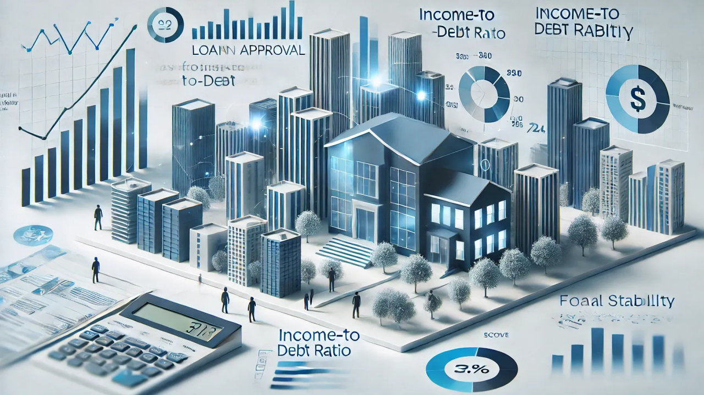
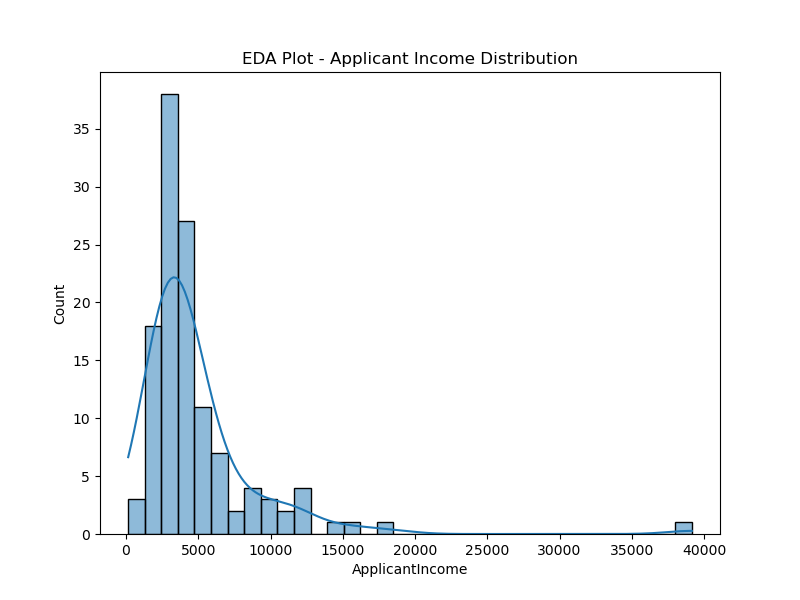
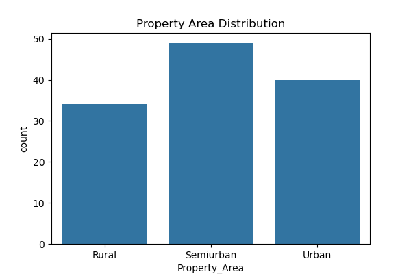
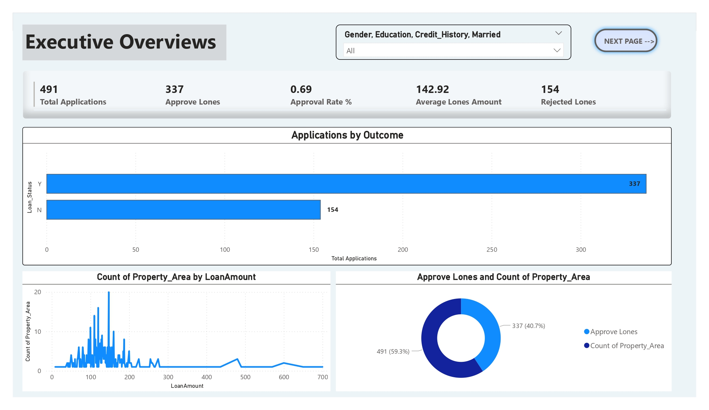
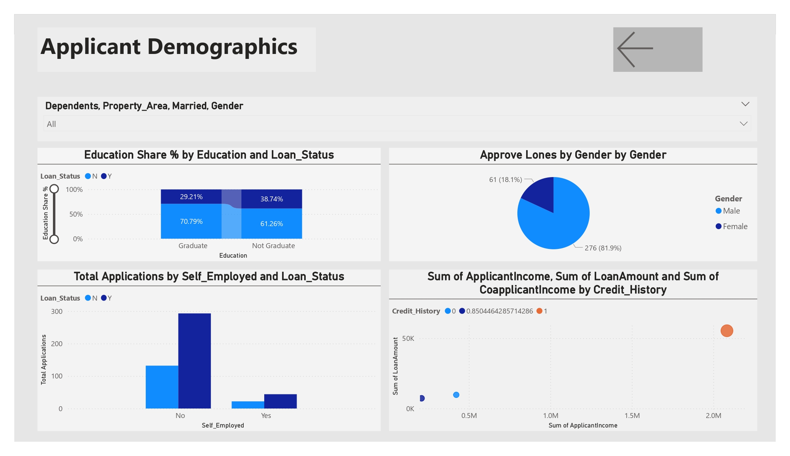

# 🏦 Real-Time Loan Eligibility Prediction.

Automating loan eligibility decisions for Dream Housing Finance using **Machine Learning** & **Exploratory Data Analysis**.

---

## 🎯 Objective

To build a classification model that predicts whether a customer is eligible for a home loan based on details submitted in the application form.  
This enables **faster**, **data-driven**, and more **consistent** loan approvals.

---

## 📁 Project Structure
---

## 📊 Dataset Description

Located in the `data/` folder:

| Feature            | Description                                |
|--------------------|--------------------------------------------|
| Loan_ID            | Unique Loan ID                             |
| Gender             | Male / Female                              |
| Married            | Applicant married (Y/N)                    |
| Dependents         | Number of dependents                       |
| Education          | Graduate / Under Graduate                  |
| Self_Employed      | Self-employed (Y/N)                        |
| ApplicantIncome    | Income of applicant                        |
| CoapplicantIncome  | Income of co-applicant                     |
| LoanAmount         | Loan amount (in thousands)                 |
| Loan_Amount_Term   | Loan repayment term (in months)            |
| Credit_History     | Meets credit guidelines (1 = Yes, 0 = No)  |
| Property_Area      | Urban / Semi Urban / Rural                 |
| Loan_Status        | Target: Loan approved (Y/N) *(train only)* |

- **Train dataset**: `train.csv`  
- **Test dataset**: `test.csv` *(for predictions)*

---

## 🔍 Exploratory Data Analysis (EDA)

Visual insights generated from `train.csv`

📷 **EDA Preview**  

📷 **Feature Importance**  

📷 **Dashboard (Excel / Power BI)**  

---

## 🧠 Model Building

Steps followed in `notebooks/Real-Time Loan Eligibility Prediction.ipynb`:

## 🧠 Model Building

In this project, we built a loan eligibility prediction model using Python libraries like **pandas**, **numpy**, and **scikit-learn**.

### Steps:

1. **Data Preprocessing**  
   - Loaded the training and test datasets using `pandas`.  
   - Converted categorical variables into numbers using `LabelEncoder` for easy processing by the model.

2. **Model Training**  
   - Used the **Random Forest Classifier** from `sklearn.ensemble` to train the model on the processed training data.  
   - Suppressed warnings with Python's `warnings` module to keep the output clean.

3. **Evaluation**  
   - Evaluated model accuracy on the training set using `accuracy_score` from `sklearn.metrics`.

4. **Model Saving**  
   - The trained model is saved for future predictions.

This approach ensures the model can accurately predict loan eligibility based on applicant details, making loan approvals faster and more consistent.

---

🏆 **Final Model**: `RandomForestClassifier`  
💾 Saved as: `Models/loan_eligibility.pkl`

---

## 🚀 Prediction

`loan_predict.py` is a script to load `test.csv` and generate predictions.

### Usage:

bash
`Real-Time Loan Eligibility Prediction.ipynb`

### 📦 Requirements
Install dependencies:
`pip install -r requirements.txt`

### ✅ Key Findings
- Credit_History is the most important feature.
- High ApplicantIncome to LoanAmount ratio improves chances.
- Married graduates from semi-urban areas had higher approval rates.
- Final model achieved 80%+ accuracy on validation set.

### 💡 Recommendations
- Auto-approve applicants with strong credit history and good income-to-loan ratios.
- Use model confidence scores for risk-based decision making.
- Retrain model periodically with new data to improve performance.

## 👥 Contributors

- **Ajam Ali** – Project Lead, Data Preprocessing, Feature Engineering, Model Development, Documentation  
- **Akash Singh Rathour** – Dashboard Design & Visualization  

We collaborated closely to bring this project to life, ensuring strong insights, automation, and impactful visuals.

